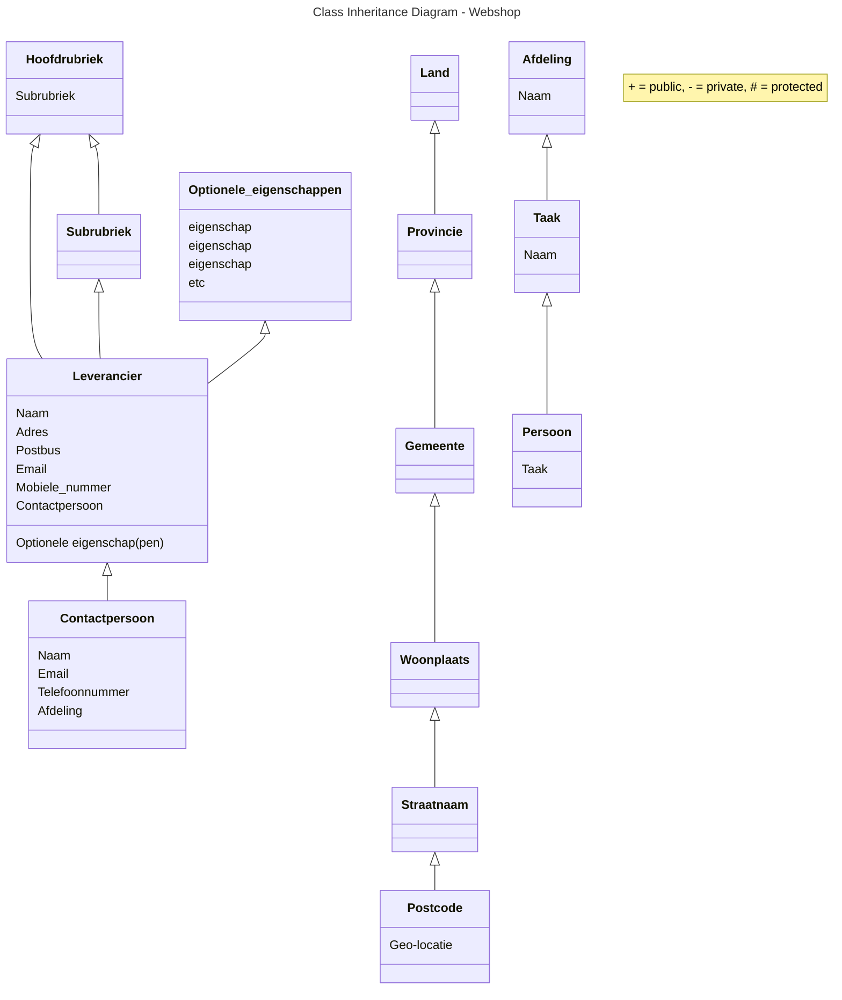

```mermaid
---
title: Class Inheritance Diagram - Webshop
---
classDiagram
    note "+ = public, - = private, # = protected"
    %% A <|-- B means that class B inherits from class A %%

    Hoofdrubriek <|-- Subrubriek
    Hoofdrubriek <|-- Leverancier
    Subrubriek <|-- Leverancier
    Optionele_eigenschappen <|-- Leverancier
    Leverancier <|-- Contactpersoon

    Land <|-- Provincie
    Provincie <|-- Gemeente
    Gemeente <|-- Woonplaats
    Woonplaats <|-- Straatnaam
    Straatnaam <|-- Postcode

    Taak <|-- Persoon
    Afdeling <|-- Taak
        

    class Hoofdrubriek {
        Subrubriek
    }

    class Subrubriek {
    }

    class Optionele_eigenschappen{
        eigenschap
        eigenschap
        eigenschap
        etc
    }

    class Leverancier{
        Naam
        Adres
        Postbus
        Email
        Mobiele_nummer
        Contactpersoon
        Optionele eigenschap(pen)
    }

    class Contactpersoon{
        Naam
        Email
        Telefoonnummer
        Afdeling
    }

    class Postcode{
        Geo-locatie
    }

    class Straatnaam{
    }

    class Woonplaats{
    }

    class Gemeente{
    }

    class Provincie{
    }

    class Land{
    }

    class Persoon{
        Taak
    }

    class Taak{
        Naam
    }

    class Afdeling{
        Naam
    }

```
